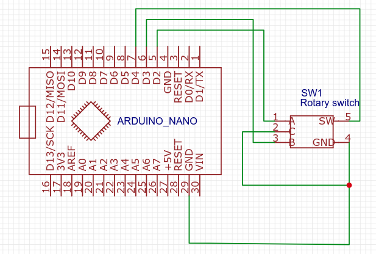
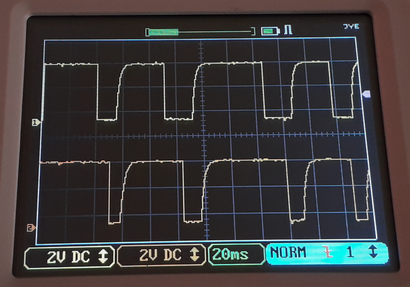
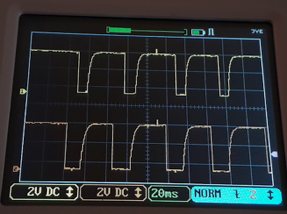

# iot-arduino-rotary-encoder

use of rotary encoder to retrieve position and hit btn

:warning: upload sketch before to connect to avoid ports burn ( if previous sketch may used D2,D3,D4 as output )

- rotary clockwise

</img>

- rotary counter clockwise

</img>

## prerequisites

- [vscode arduino](https://github.com/devel0/knowledge/blob/master/doc/vscode-arduino.md)

## build

- tune `.vscode/c_cpp_properties.json` according to your paths
- `ctrl+shift+p arduino board config` : Arduno Nano / ATmega328P (Old Bootloader)
- `ctrl+alt+u` to upload
